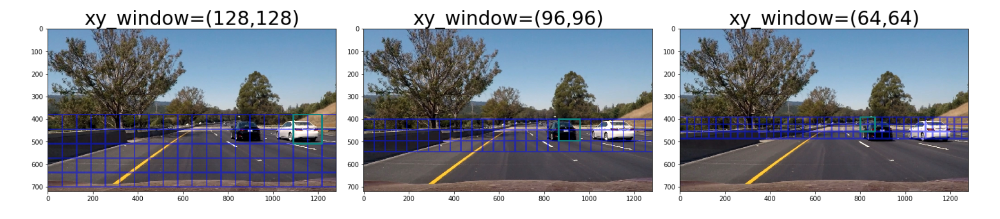
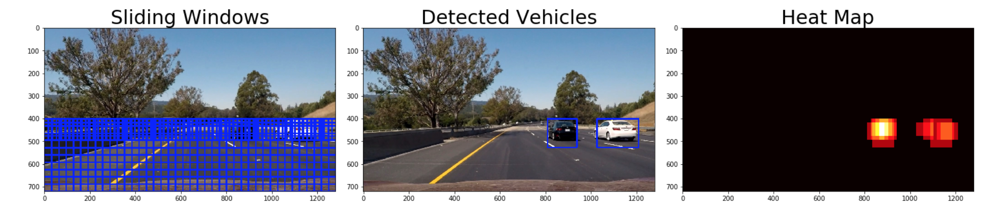
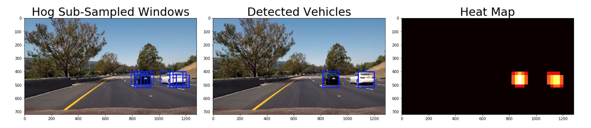
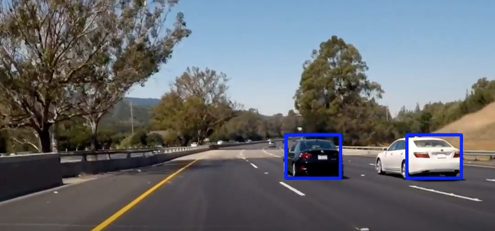

# CarND-P5-Vehicle-Detection-Tracking

### Summary
- Developed a software pipeline to identify vehicles in a video from front-facing car camera.
- Used Histogram of Oriented Gradients (HOG) feature extraction on labeled images.
- Trained the Linear Support Vector Machine (SVM) Classifier with a 99% test accuracy.

### Project Overview

In this project, the goal is to write a software pipeline to detect vehicles in a video (starting with the test_video.mp4 and later implementing on full project_video.mp4).   

The steps of this project are as follows:

* Perform a Histogram of Oriented Gradients (HOG) feature extraction on a labeled training set of images and train a classifier Linear SVM classifier
* Optionally, you can also apply a color transform and append binned color features, as well as histograms of color, to your HOG feature vector. 
* Note: for those first two steps don't forget to normalize your features and randomize a selection for training and testing.
* Implement a sliding-window technique and use your trained classifier to search for vehicles in images.
* Run your pipeline on a video stream (start with the test_video.mp4 and later implement on full project_video.mp4) and create a heat map of recurring detections frame by frame to reject outliers and follow detected vehicles.
* Estimate a bounding box for vehicles detected.

### Datasets
- The labeled data [vehicle](https://s3.amazonaws.com/udacity-sdc/Vehicle_Tracking/vehicles.zip) and [non-vehicle](https://s3.amazonaws.com/udacity-sdc/Vehicle_Tracking/non-vehicles.zip) to train the classifier.  
- These example images come from a combination of the [GTI vehicle image database](http://www.gti.ssr.upm.es/data/Vehicle_database.html), the [KITTI vision benchmark suite](http://www.cvlibs.net/datasets/kitti/), and examples extracted from the project video itself. 
- The recently released [Udacity labeled dataset](https://github.com/udacity/self-driving-car/tree/master/annotations) can be used to augment the training data.  
- Some example images for testing the pipeline on single frames are located in the `test_images` folder. Some examples of the output from each stage of my pipeline are saved in the folder called `ouput_images`.

### Files
[Jupyter Notebook](https://github.com/preeti-chauhan/SDCND-P5-Vehicle-Detection-Tracking/blob/master/P5.ipynb) : project code development

### Results

**Test Sliding Windows:**

**Multi Scale Sliding Window Search:**

**Image Processing Pipeline using Hog Sub-sampling Window Search:**

**Test Video Processing Pipeline:**

[This](https://www.youtube.com/watch?v=gluKWuigiUI) video demonstrates that the pipeline works well in vehicle detection and tracking:

